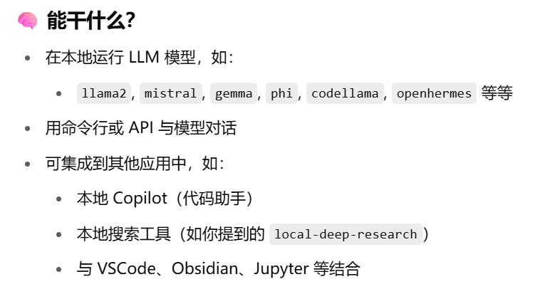

### **熟能生巧**

### git

更新分支

```
# 1. 切换到 gjh 分支（如果不在的话）
git checkout feature_gjh

# 2. 从远程拉取最新代码，并与本地合并
git pull origin feature_gjh

# 3. 添加你的修改到暂存区
git add .

# 4. 提交到本地仓库
git commit -m "你的提交信息"

# 5. 推送到远程仓库
git push origin feature_gjh
```

合并gjh分支到main分支，先将远程的main merge到本地，命令行merge是将本地的feature_gjh merge到本地的main,再推到远程的main

```
# 1. 切换到 main 分支
git checkout main

# 2. 从远程拉取最新代码，保持本地 main 为最新
git pull origin main

# 3. 将 gjh 分支合并到 main
git merge feature_gjh

# 4. 将合并后的 main 推送到远程仓库
git push origin main
```

合并main分支到feature_gjh分支

```
# 1. 切换到 gjh 分支
git checkout feature_gjh

# 2. 从远程拉取 gjh 的最新代码
git pull origin feature_gjh

# 3. 合并 main 分支到 feature_gjh
git merge main

# 4. 推送合并后的 gjh 分支到远程
git push origin feature_gjh
```

括号内(feature_gjh)表示当前分支，切换后为主分支显示(main)


### scrapy


**`MySpider.from_crawler()`** 这个类方法来创建你的 Spider 实例（也就是对象）。在创建过程中，它还会把 `Crawler` 和 `Settings` 对象绑定到你的 Spider 实例上。

**`from_crawler()` 的核心作用**

简单来说，`from_crawler()` 是 Scrapy 框架创建 Spider 实例的**工厂方法**。当你使用 `scrapy crawl <spider_name>` 命令时，Scrapy 内部不会直接调用你 Spider 类的 `__init__()` 方法，而是调用 `from_crawler()`。

它的主要职责有两个：

1. **实例化 Spider**：它调用 `__init__()` 方法来创建你的 Spider 实例。这意味着你传给 `scrapy crawl` 命令的任何参数，都会通过 `*args` 和 `**kwargs` 传递给 `__init__()`。
2. **绑定核心组件**：它将两个非常重要的属性绑定到新创建的 Spider 实例上：
   - **`crawler`**：一个 `Crawler` 实例，它是 Scrapy 项目的“心脏”，包含了各种核心组件（如扩展、中间件、信号管理器等）。通过它，你的 Spider 可以访问到整个 Scrapy 引擎。
   - **`settings`**：一个 `Settings` 实例，包含了当前爬虫运行时的所有配置。这让你可以在 Spider 内部方便地读取和使用项目或自定义的设置。

**`custom_settings`**:

- **类型**：一个静态的字典 (`dict`)。
- **使用方式**：直接在 Spider 类中定义。
- **特点**：简单、直接。如果您只需要覆盖少量固定的设置，这是最方便的方式。
- **局限性**：它是一个固定的字典，无法根据运行时条件动态调整。如果您想在子类中扩展或修改父类的设置，可能需要复杂的代码来合并字典，这并不优雅。

**`update_settings()`**:

- **类型**：一个类方法 (`classmethod`)。
- **使用方式**：需要重写这个方法，并在其中编写逻辑。
- **特点**：**更灵活、更强大**。它允许您基于其他因素（如另一个设置的值）来动态修改设置。
- **优势**：
  1. **动态性**：可以根据 Spider 的其他属性或外部条件来动态生成设置。
  2. **可扩展性**：在面向对象编程中，子类可以轻松地通过调用 `super().update_settings(settings)` 来继承父类的设置，并在其基础上添加或修改自己的设置，这比处理字典合并要简单得多。
  3. **优先级**：它允许您以高于 `custom_settings` 的优先级来应用配置，因为它是以编程方式修改 `Settings` 对象。

### typora图片相对路径

文件->偏好设置->图像

设置为如下相对路径

```
./IMG/${filename}.assets
```


### 命令行执行时打断点

```python
import pdb
pdb.set_trace()

```

查看参数值

| 命令                     | 作用                    | 示例                     |
| ------------------------ | ----------------------- | ------------------------ |
| `p 变量名`               | 查看变量的值（print）   | `p args`、`p args.query` |
| `pp 变量名`              | 以格式化方式查看变量    | `pp args.__dict__`       |
| `args`                   | 查看函数的参数          | 用于函数内部的断点       |
| `locals()` / `globals()` | 查看局部 / 全局变量字典 | `p locals()`             |
| `! 表达式`               | 执行任意 Python 表达式  | `!len(args.kb_ids)`      |

调试命令

| 命令 | 含义                               |
| ---- | ---------------------------------- |
| `n`  | 执行下一行（next）                 |
| `s`  | 进入函数（step）                   |
| `c`  | 继续执行直到下一个断点（continue） |
| `l`  | 查看当前代码段（list）             |
| `q`  | 退出调试（quit）                   |

### 常用指令

#### 启动公司服务器的clash

`cd /root/clash`

`./clash -f config.yaml`

**服务器账号**

```yaml
#school
Host 192.168.3.13
 HostName 192.168..13
  User root
  password:mustang


Host 192.168.3.72
  HostName 192.168.3.72
  User huji

#境外服务器
Host  43.162.119.42
  Hostname  43.162.119.42
  User  root
  password:123123

#yintaoo
Host  192.168.3.63
  Hostname  192.168.3.63
  User  yintaoo
  password:yt123456
```

**with 语法确保：即使中间代码出错，锁也一定会释放，避免死锁。**(多进程manager)

全局搜索

```
ctrl shift f
```

进程查看

```
htop
```

清内存：  

```linux
rm -rf ~/.vscode-server  
```

查看内存使用情况 

```
df -h
```


将爬取内容拷贝到另一台服务器：

修改下载脚本文件:

在data/spider目录下

```
nano download.py
```

运行下载脚本文件

```
python download.py
```

​                                                        


删除文件    

```
rm -f /root/spider/output-C70C-part13
```

查看是否成功删除

```
ls -l /root/spider/output-C70C-part13
```

更新数据（避免缓存与内存数据不一致）

```
sync
```

vscode连接不上：内存爆了

爬取数据 

创建并进入名为spider的会话

```
tmux new -s spider
```

<mark>切换到spider环境</mark>

```
conda activate spider
```

在会话中运行main

```
python main.py
```

<mark> 断开重连后重新进入会话</mark>

```
tmux attach -t spider
```

删除会话

```
tmux kill-session -t spider
```


wps

### 爬虫服务器设置

**国外IP**：https://www.kookeey.com/

用户名15387939320   密码：实验室wifi

生成api提取连接（要将实验室服务器ip设成白名单才可以用）


**kookeey的工作方式是->生成api提取连接->本地向kookeey发起get请求->获取kookeey的IP！**

[API获取_海外HTTP代理_Socks5代理-kookeey可壳代理](https://www.kookeey.com/apidoc#order-takeip)**这里解释理论如何编写get请求的url获取ip(比如n后面的数字表示获取的ip数目)**


**国内ip**

生成api连接


要将实验室ip设为白名单


**内网穿透**

爬虫服务器的server.py(是上个目录的server)

用于暴露ip地址，使公司服务器和爬虫服务器可以通信

只用python server.py让server一直在后台运行就可以了，不用管了


**专利号提取**

专利号保存在爬虫服务器的input文件夹下


**专利号获取方法：**

在这个网址下[Classification Browser - PubChem](https://pubchem.ncbi.nlm.nih.gov/classification/#hid=58&show_counts=patent)

现在已经下载到了07C


点右边patents下载再点download再点csv即可下载


下载出来是csv


利用<mark>test.py</mark>数据清洗，只提取专利号，然后将提取好的数据保存到爬虫服务器的input文件夹


### 获取网页的请求方式

**XHR 或 Fetch 请求**


### 爬取静态网页

#### 静态网页和动态网页：

省流：按Elements中如果有<scripts>标签，就是动态网页，没法通过requests.get()、find()、find_all()来爬取

原因：requests.get()只能从网页端返回html源代码，如果html源代码中有JavaScript代码，需要浏览器渲染解析，但是requests.get()不包含这一项功能。因此只能用Selenium模拟手动访问

#### **动态网页的加载方式**

好的，我们来详细解释一下 JavaScript 和页面加载的先后关系，以及这如何影响你爬取动态内容的尝试。

理解这个问题，需要区分“浏览器加载页面”和“JavaScript 执行”这两个过程。

1. **初始 HTML 加载 (Initial HTML Load):**
   - 当你在浏览器中输入一个 URL 或点击一个链接时，浏览器会向服务器发送一个 HTTP 请求。
   - 服务器返回的是**原始的 HTML 文档**。这个文档包含了页面的基本结构（如 `<html>`, `<head>`, `<body>` 标签），可能还有一些初始的文本、图片引用、CSS 样式表链接以及 **JavaScript 脚本的链接或内联代码**。
   - 此时，浏览器开始解析这个 HTML 文档，并构建 DOM (Document Object Model) 树。这个阶段，页面上的大部分静态内容（直接写在 HTML 里的）会开始渲染。
2. **CSS 加载和渲染 (CSS Load and Render):**
   - 在解析 HTML 的同时，浏览器也会发现并加载 CSS 样式表。
   - CSS 决定了页面的外观（颜色、布局、字体等）。
3. **JavaScript 加载和执行 (JavaScript Load and Execution):**
   - **同步脚本：** 如果 HTML 中有 `<script>` 标签（默认行为），浏览器会在解析到它时暂停 HTML 的解析，先下载并执行这个 JavaScript 文件或内联代码。只有当脚本执行完毕后，HTML 的解析才会继续。这可能会阻塞页面渲染。
   - **异步脚本：** 使用 `async` 或 `defer` 属性的脚本不会阻塞 HTML 解析。
     - `async`：脚本会异步下载并在下载完成后立即执行，不保证执行顺序。
     - `defer`：脚本会异步下载，但会等到 HTML 解析完毕后，在 `DOMContentLoaded` 事件之前执行，并按照它们在 HTML 中出现的顺序执行。
   - **通过 JavaScript 动态生成内容 (Dynamic Content Generation):** 许多现代网站会利用 JavaScript 来：
     - **从后端 API 请求数据：** 例如，通过 AJAX (Asynchronous JavaScript and XML) 或 Fetch API 向服务器发送请求，获取 JSON 数据。
     - **根据数据动态修改 DOM：** 当 JavaScript 收到数据后，它会创建新的 HTML 元素（如 `div`, `p`, `a` 等），并使用这些数据填充它们，然后将这些新创建的元素插入到已有的 DOM 树中。
     - **处理用户交互：** 响应点击、滚动等事件。

#### **不同网页的处理方法**

**静态网页 (Static Web Pages):**

- 页面内容在服务器响应时就已经完全包含在 HTML 文件中。
- `requests` 库可以直接获取到完整的 HTML 源代码。
- `BeautifulSoup` 等解析库可以直接解析这个 HTML，提取所需数据。
- **优点：** 速度快，资源消耗少。

**动态网页 (Dynamic Web Pages):**

- 页面的核心内容（或部分内容）是在浏览器加载完初始 HTML 后，通过 **JavaScript 异步请求数据**并**动态渲染**到页面上的。
- `requests` 库**无法执行 JavaScript**。因此，它只能获取到初始的 HTML 骨架，而看不到 JavaScript 后面加载和生成的内容。
- 在这种情况下，就需要使用 **Selenium**（或其他无头浏览器库如 Puppeteer、Playwright 等）。
- **Selenium 的作用：**
  - 它启动一个真实的浏览器实例（或者在后台运行的“无头”浏览器）。
  - 浏览器会像我们平时上网一样，加载 HTML、CSS，**并执行所有的 JavaScript 代码**。
  - 等待 JavaScript 执行完毕，页面内容完全加载并渲染出来后，Selenium 才能获取到页面的**最终 HTML 源代码**（也就是你肉眼看到的样子）。
  - 然后，你可以将这个由 Selenium 获取到的完整 HTML 源代码传递给 `BeautifulSoup` 进行解析。
- **优点：** 能够处理任何浏览器中能显示的内容。
- **缺点：** 速度相对较慢，资源消耗大（因为它要启动一个完整的浏览器）。

#### 练习爬取静态网页[图书售卖](https://books.toscrape.com/)

elements没有<scripts>标签--->静态网页，可以用常规方法爬取

右键图书，点击检查，定位到html代码位置

可以看到，图书信息是li标签，class = col-xs-6 col-sm-4 col-md-3 col-lg-3

我们需要每本书的url，因此先find（）定位到a标签，再get("href")查看该属性对应的url


通过requests.get进入图书信息页

想要下载图书封面jpg,首先右键定位到html代码

div标签下的item active类

再进入其中的img标签，src属性

就可以下载了


```python

from bs4 import BeautifulSoup
import requests
import urllib.parse

url = "https://books.toscrape.com/catalogue/category/books/historical-fiction_4/index.html"
response = requests.get(url, timeout=(10, 30))
page = BeautifulSoup(response.text, 'html.parser')  # 解析html字符串

# todo:find()找到第一个匹配项，find_all()找出所有匹配项

# todo:需要先找到 <li> 标签内部的 <a> 标签，然后再从那个 <a> 标签中提取 href 属性。
elements = page.find_all('li', class_="col-xs-6 col-sm-4 col-md-3 col-lg-3")
for elem in elements:
    tag = elem.find("a")
    src = tag.get("href")  # 获取相对路径

    # 使用 urllib.parse.urljoin 来拼接成完整的绝对URL
    # base_url 应该是当前列表页面的 URL
    full_url = urllib.parse.urljoin(url, src)
    print(f"找到的完整 href 链接:" + str(full_url))
    
    # todo:进入这本书的网页内部，爬取图片的url
    book_response = requests.get(full_url)
    book_page = page = BeautifulSoup(book_response.text, 'html.parser')
    jpg = book_page.find('div', class_="item active")
    tag = jpg.find('img')
    img_src = tag.get("src")
    print("img_src:     "+str(img_src))

    # 获取书名
    book_title_tag = elem.find('h3').find('a')
    if book_title_tag:
        book_title = book_title_tag.get('title')
        print(f"书名: {book_title}")

    # 获取价格
    price_tag = elem.find('p', class_='price_color')
    if price_tag:
        book_price = price_tag.get_text(strip=True)
        print(f"价格: {book_price}")
```


#### 动态网页调试

FDA官网为例，输入aspirin，返回aspirin有关列表，注意URL为https://www.accessdata.fda.gov/scripts/cder/daf/index.cfm?event=BasicSearch.process，NETWORK抓包后第一个文件为index.cfm?events=BasicSearch.process，于是查看该请求。


### google chorm调试

#### elements:按键位置

比如想找contact对应的源代码，直接右键选inspect，就可以定位到源代码位置

左边elements可以通过代码找到contsct按键的具体位置，右边就是按键的具体信息，style字体还有颜色之类的，compute为间距css盒子，EventListeners为绑定的事件。

这个herf跟的一个跳转链接


爬取列表：


#### console:元素属性，日志

console.dir($元素)：打印元素类的所有属性

`console.dir()` 的作用是**以 JavaScript 对象的属性列表形式**（而不是 HTML 树结构形式）来显示指定对象。**该 HTML 元素作为一个 JavaScript 对象的属性和方法。** 这包括：

- **常规的 HTML 元素属性：** `id`, `className`, `tagName`, `href`, `src`, `value`, `textContent`, `innerHTML` 等。
- **CSS 相关属性：** `style` (一个 CSSStyleDeclaration 对象，包含了通过 JavaScript 设置的行内样式), `classList` (一个 DOMTokenList 对象，包含了所有的 class 名称)。


#### Sources查看文件，打断点看属性值

专注于调试JavaScript代码，以及查看和管理所有加载到页面中的资源文件（JavaScript、CSS、图像等）。


### 简单爬虫实现

```python
import requests
from bs4 import BeautifulSoup
from urllib.parse import urljoin
url = r"http://www.cse.cqu.edu.cn/szdw1/fjs_fyjy_gjgcs.htm"
headers = {
    'User-Agent': 'Mozilla/5.0 (Windows NT 10.0; Win64; x64) AppleWebKit/537.36 (KHTML, like Gecko) Chrome/124.0.0.0 Safari/537.36',
    'X-Requested-With': 'XMLHttpRequest',
    'Referer': 'https://patents.google.com/',
    'Accept': '*/*',
    'Accept-Language': 'en-US,en;q=0.9',
    'Connection': 'keep-alive',
    'Content-Type': 'application/json',
    'accept': 'application/json'

}

response = requests.get(url, headers=headers, verify=False)
response.encoding = response.apparent_encoding      # 修复乱码
if response.status_code==200:
    html = response.text
    soup = BeautifulSoup(html, 'html.parser')       # soup 是一个 BeautifulSoup 对象，表示你已经解析好的 HTML 文档结构。
    # 提取所有 <li> 里面的 <a>
    teacherset = soup.select('li a')      # 在 HTML 文档中，找到所有 <li> 标签里面的 <a> 标签，
                                        # 返回这些 <a> 标签的列表（一个元素是一个 <a> 标签的 BeautifulSoup 对象）
                                        # 保存成set

    # 保存为字典
    teacher_info = {}
    for teacher in teacherset:
        name = teacher.get_text(strip=True)  # 教师名字
        href = urljoin("https://www.cse.cqu.edu.cn", teacher.get('href'))  # 用来把相对路径转换成完整的绝对 URL
        teacher_info[name] = href

    # 打印结果验证
    for name, url in teacher_info.items():
        print(name, "=>", url)
else:
    print(response.status_code)
```


### markdown

<mark>高亮</mark>

> 这是一段引用文字
>
> > 二级引用

分割线---

---


**server.py解析**

server.py会在[目录: /](http://127.0.0.1:8000/)生成一个文件查看器，可以点击下载其中的文件。

爬虫服务器是租赁的，应该是可以直接访问的。server.py位于爬虫服务器上，接受公司服务器发来的请求，并返回相应结果。


### python类

#### python包

省流：文件夹有多个py文件，就得再有一个--init--.py标识这是一个包

作用：可以方便引用！

如：from ecommerce.cart.cart_ops import add_to_cart


### Flask

#### url与http


<mark>省流：url就是带<>带参数的，http就是规定了是post方法或者是什么方法</mark>

```python
from flask import Flask, jsonify,redirect,url_for,render_template

# 创建Flask应用实例
app = Flask(__name__)

# 定义路由和视图函数
@app.route('/app')                     # http://127.0.0.1:5000/app
def app1():
    return 'Hello'

#url传入参数，返回json
@app.route('/user/<username>')      # http://127.0.0.1:5000/user/bob
def show_user_profile(username):
    # jsonify将字典转化为json
    return jsonify({"name": username, "type": "String"})

#url传入参数
@app.route('/post/<int:post_id>')   # http://127.0.0.1:5000/post/12
def show_post(post_id):
    return f'Post {post_id}'


#重定向到某个函数
@app.route('/hello')                # http://127.0.0.1:5000/hello
def redirect_example():                     #要在开头引入redirect,url_for
    return redirect(url_for('app1'))         #todo:重定向到传入的函数名app1


# 加载html来渲染，html默认在templates文件夹下
@app.route('/template')             # http://127.0.0.1:5000/template
def template_example():
    return render_template('example.html', name='Flask')


# 启动应用
if __name__ == '__main__':
    app.run(debug=True)
    # app.run(host='127.0.0.1', port=5000, debug=True)  #等价于这个

```

## 语法部分

### python字符串

strip()           如果首尾出现括号里的内容，则去除。

```python
# .strip()：去除字符串首尾的空格或换行符，避免出现空行。

print str.strip('0' );  # 去除首尾字符 0
```


.split()         按括号内的内容拆分字符串

```python
# 按换行符拆分
ip_list = response.text.strip().split('\n')
```


.resplace('\r','')             替换

```python
# 去除可能来自 Windows 格式的回车符 \r，使每个 IP 变得干净可靠。
valid_ips = [ip.replace('\r','') for ip in ip_list if ":" in ip]
```

### **处理不定数量参数的特殊语法**

`*args`**用于收集**不定数量的位置参数**。

`args` 是一个**元组（tuple）**，包含了所有传递给函数的位置参数。

```python
def add(*args):
    total = 0
    for num in args:
        total += num
    return total

print(add(1, 2))        # 输出: 3
print(add(1, 2, 3, 4))  # 输出: 10
print(add())            # 输出: 0
```

### kwargs 用于收集**不定数量的关键字参数**。

`kwargs` 是一个**字典（dict）**，包含了所有以 `key=value` 形式传递给函数的参数。

```python
def print_info(**kwargs):
    for key, value in kwargs.items():
        print(f"{key}: {value}")

print_info(name="Alice", age=30)
# 输出:
# name: Alice
# age: 30

print_info(city="New York", country="USA", population=8000000)
# 输出:
# city: New York
# country: USA
# population: 8000000
```

两者结合使用

```python
def my_function(fixed_arg, *args, **kwargs):
    print(f"固定参数: {fixed_arg}")
    print(f"位置参数元组: {args}")
    print(f"关键字参数字典: {kwargs}")

my_function("Hello", 1, 2, 3, name="Bob", job="Developer")
# 输出:
# 固定参数: Hello
# 位置参数元组: (1, 2, 3)
# 关键字参数字典: {'name': 'Bob', 'job': 'Developer'}
```

### argparse 解析命令行参数

```python
if __name__ == '__main__':
    # 创建ArgumentParser对象，ArgumentParser是创建一个解析器对象的类
    parser = argparse.ArgumentParser(description='Convert one or more JSON files into a single CSV file (horizontal format).')
    # parser.add_argument这是向解析器添加参数的方法。每个 add_argument 调用都定义了脚本期望接收的一个命令行参数。
    # nargs='+' 表示这个参数期望接收一个或多个值
    parser.add_argument('json_files', nargs='+', help='The path(s) to the input JSON file(s).')
    parser.add_argument('csv_file', help='The path to the single output CSV file.')
    
    # action='store_true' 是一个特殊的动作，它将参数的值设置为 True
    # 可选参数，使用双破折号 -- 开头
    parser.add_argument('--append', action='store_true', help='Append to the CSV file if it exists. The script will add new columns if necessary.')

    
    # parse_args() 方法会解析命令行中提供的所有参数。
    args = parser.parse_args()

    convert_multiple_json_to_csv(args.json_files, args.csv_file, args.append)
```

### with和async异步完成文件读取

**`with` 最常见的用途是处理那些需要“打开”和“关闭”的资源，比如文件、数据库连接**

```python
# 使用 with 语句
with open("example.txt", "w") as f:
    f.write("Hello, World!")

# 优点：文件 f 会在 with 代码块结束后自动关闭，即使中间发生错误。
# 你不需要手动调用 f.close()。
```

**`with` 也可以用来管理数据库连接，确保连接在使用后被正确关闭**

```python
import sqlite3

with sqlite3.connect('database.db') as conn:
    cursor = conn.cursor()
    cursor.execute("SELECT * FROM users")
    data = cursor.fetchall()
    # 在这里，无论是否发生错误，数据库连接都会在 with 块结束后自动关闭。
```


### python多进程

#### 多进程适用于I/O密集型操作


#### multiprocessing

| 组件                   | 用途                                   |
| ---------------------- | -------------------------------------- |
| `Process`              | 创建新进程，类似线程Thread             |
| `Pool`                 | 进程池，管理多个进程，实现任务并行执行 |
| `Queue`                | 进程间安全通信队列                     |
| `Pipe`                 | 进程间双向通信管道                     |
| `Manager`              | 管理共享数据，实现进程间共享变量       |
| `Lock`, `Semaphore` 等 | 进程间同步和互斥机制                   |

#### Process创建新进程

```python
from multiprocessing import Process

def worker(name):
    print(f"Worker {name} is running")

if __name__ == '__main__':
    p = Process(target=worker, args=('A',))
    p.start()
    p.join()  # 等待进程结束

```


#### Pool进程池

创建**with创建pool对象和直接创建pool对象的区别**

```python
with Pool(processes=config.processes) as pool:
#相当于
pool = Pool(...)
try:
    ...
finally:
    pool.close()
    pool.join()
# with语句创建对象能够实现自动close() 和 join()
```


| 方法                                  | 描述                                                         |
| ------------------------------------- | ------------------------------------------------------------ |
| `pool.map(func, iterable)`            | 类似于内置的 `map()`，将 `iterable` 中的每个元素都作为参数传入 `func` 并并行执行，**顺序返回结果** |
| `pool.imap(func, iterable)`           | 类似 `map()`，但返回的是一个迭代器，可以逐个获取结果，更适合处理大量数据 |
| `pool.imap_unordered(func, iterable)` | 与 `imap()` 类似，但谁先处理完就先返回（**无序返回，效率更高**）✅ |
| `pool.apply(func, args)`              | 同步执行函数                                                 |
| `pool.apply_async(func, args)`        | 异步提交任务，返回 `AsyncResult` 对象                        |
| `pool.close()`                        | 关闭进程池，停止接收新任务                                   |
| `pool.terminate()`                    | 立即终止所有进程，不等任务完成                               |
| `pool.join()`                         | 等待所有进程执行完毕（需先 `close()` 或 `terminate()`）      |

分成四个进程来做

```python
from multiprocessing import Pool

def square(x):
    return x * x

if __name__ == '__main__':
    with Pool(processes=4) as pool:					# 分成四个进程
        results = pool.map(square, [1, 2, 3, 4, 5])		# 参数为方法,任务列表
        print(results)  # 输出: [1, 4, 9, 16, 25]

```


**下载代理池配置（pool）**

```python
    task_args = [(patent, global_proxy_pool, config_dict, completed_patents) for patent in patent_number


    try:
        # todo:进程池
        # 使用多进程处理
        with Pool(processes=config.processes) as pool:  # 创建一个进程池对象，同时最多运行 config.processes 个子进程
            # 使用tqdm显示进度
            for result in tqdm(pool.imap_unordered(process_patent, task_args),total=total_patents,desc="处理专利"):
```

**process_patent具体操作**

```python
def process_patent(args: Tuple) -> Optional[PatentData]:
    """
    处理单个专利 - 共享全局代理池
    
    参数:
        args: (专利编号, 全局代理池, 配置字典, 已完成专利列表)
        
    返回:
        Optional[PatentData]: 专利数据对象
    """
    patent_number, proxy_pool, config_dict, completed_patents_list = args

    # 如果已经处理过，跳过
    if patent_number in completed_patents_list:
        logging.info(f"跳过已处理的专利: {patent_number}")
        return None

    # 初始化专利数据
    patent_data = PatentData(patent_number=patent_number)

    # 尝试获取专利信息
    for attempt in range(config_dict['max_retries']):
        try:
            
			### 获取代理

            proxies = proxy_pool.get_proxy()    # GlobalProxyPool类的get_proxy()从代理池获得一个代理
            if not proxies:
                logging.warning(f"专利 {patent_number} 无可用代理，尝试 {attempt + 1}")
                # 使用指数退避策略
                time.sleep(min(30, (config_dict['retry_delay'] * (2 ** attempt))))
                continue

            ### 获取专利信息
            res = patent_stil.getGooglePatentInfo(patent_number, language="auto", proxies=proxies)

            ### 下载PDF
            pdf_path = os.path.join(config_dict['output_dir'], f"{patent_number}.pdf")
            patent_stil.downloadGooglePdf(res.pdf_url, save_path=pdf_path)

            # 更新数据
            patent_data = PatentData(       # 写入类
                patent_number=patent_number,
                title=res.title,
                inventors=res.inventors,
                abstract=res.abstract,
                descriptions=res.descriptions,
                pdf_path=pdf_path,
                status="success"
            )

            # 成功后跳出循环
            break

        except Exception as e:
            logging.warning(f"专利 {patent_number} 第 {attempt + 1} 次尝试失败: {str(e)}")
            # 使用指数退避策略
            time.sleep(min(30, (config_dict['retry_delay'] * (2 ** attempt))))

    return patent_data

```


#### Queue进程间通信

<mark>进程级消息队列</mark>

 <mark>**管道 + 锁机制** </mark>

**主进程派发任务（生产者）到队列，多个子进程并发处理（消费者）。**

**子进程将结果放回另一个队列中，主进程收集结果。**

```python
from multiprocessing import Process, Queue

def producer(q):
    for i in range(5):
        q.put(i)
    q.put(None)  # 发送结束信号

def consumer(q):
    while True:
        item = q.get()
        if item is None:
            break
        print(f"Got {item}")

if __name__ == "__main__":
    q = Queue()
    p1 = Process(target=producer, args=(q,))
    p2 = Process(target=consumer, args=(q,))
    p1.start()  # 启动生产者
    p2.start()  # 启动消费者
    p1.join()   # 主进程等待生产者结束后再进行
    p2.join()   # 主进程等待消费者结束后再进行

```


#### Manager共享变量


| 类型          | 说明                       |
| ------------- | -------------------------- |
| `list()`      | 多进程共享的列表           |
| `dict()`      | 多进程共享的字典           |
| `Namespace()` | 类似对象的命名空间         |
| `Queue()`     | 多进程安全的队列           |
| `Lock()`      | 跨进程锁                   |
| `Value()`     | 共享的单个变量（类型固定） |
| `Array()`     | 共享数组（定长）           |

**共享 list**

```python
from multiprocessing import Process, Manager

def add_numbers(shared_list):
    for i in range(5):
        shared_list.append(i)

if __name__ == '__main__':
    with Manager() as manager:
        lst = manager.list()  # 创建共享列表
        p1 = Process(target=add_numbers, args=(lst,))
        p2 = Process(target=add_numbers, args=(lst,))
        
        p1.start()
        p2.start()
        p1.join()
        p2.join()

        print("结果：", list(lst))  # 输出：[0,1,2,3,4,0,1,2,3,4]

```

**共享 dict + Lock**

```python
from multiprocessing import Process, Manager
import time

def worker(shared_dict, lock, idx):
    # with lock防止“多个进程或线程同时修改同一份数据”而导致的数据冲突或错误。
    # with 语法确保：即使中间代码出错，锁也一定会释放，避免死锁。
    with lock:
        shared_dict[idx] = f"任务{idx}完成"

if __name__ == '__main__':
    with Manager() as manager:
        d = manager.dict()  # 共享 dict
        lock = manager.Lock()  # 跨进程锁

        jobs = []
        for i in range(5):
            p = Process(target=worker, args=(d, lock, i))
            jobs.append(p)
            p.start()

        for j in jobs:
            j.join()

        print(dict(d))

```


#### queue和manager对比

| 特性          | Manager                    | Queue                 |
| ------------- | -------------------------- | --------------------- |
| 支持多种对象  | ✅ list, dict, lock 等      | ❌ 仅支持 FIFO 队列    |
| 用于数据共享  | ✅（读写状态数据）          | ✅（传递消息、任务）   |
| 性能          | ❌ 较慢（通过 socket 实现） | ✅ 快速（底层是 pipe） |
| 线程/进程安全 | ✅                          | ✅                     |

### python多线程

Python的多线程

<mark>只有用于I/O密集型程序时效率才会有明显的提高</mark>

如文件/输入输出/socket网络通信/http通讯等待

#### join

**join()主进程等子进程完成后再进行，不然主进程于子进程会交替着进行**

**带join()**

```python
from multiprocessing import Process
import time

def worker():
    print("子进程开始工作")
    time.sleep(2)
    print("子进程完成工作")

if __name__ == '__main__':
    p = Process(target=worker)
    p.start()
    print("主进程等待子进程完成")
    p.join()
    print("主进程继续执行")
    
# 子进程开始工作
# 主进程等待子进程完成
# 子进程完成工作
# 主进程继续执行

# 主进程 等待 子进程 执行完后才继续
```

**不带join()**⚠️ 可能主进程早结束导致问题

```python
from multiprocessing import Process
import time

def worker():
    print("子进程开始工作")
    time.sleep(2)
    print("子进程完成工作")

if __name__ == '__main__':
    p = Process(target=worker)
    p.start()
    print("主进程不等待，直接继续执行")
    # 没有 p.join()
    print("主进程结束")

# 子进程开始工作
# 主进程不等待，直接继续执行
# 主进程结束
# 子进程完成工作
    
# 主进程 不等待 子进程，可能先结束，甚至在某些场景下导致子进程被系统杀掉或主进程收尾太早。 
 
```


#### 利用对象


**守护线程**

```python
from threading import Thread
from time import sleep, ctime
class MyClass(object):

    def func(self,name,sec):
        print('---开始---', name, '时间', ctime())
        sleep(sec)
        print('***结束***', name, '时间', ctime())
def main():
    # 创建 Thread 实例
    t1 = Thread(target=MyClass().func, args=(1, 1))
    t2 = Thread(target=MyClass().func, args=(2, 2))
    
    # 也可以创建 Thread 函数
	# t1 = Thread(target=func, args=('第一个线程', 1))
	# t2 = Thread(target=func, args=('第二个线程', 2))
    
    # 启动线程运行
    t1.start()
    t2.start()
    # 等待所有线程执行完毕
    t1.join()  # join() 等待线程终止，要不然一直挂起
    t2.join()

if __name__=="__main__":
    main()
```


#### thread子类

```python
from threading import Thread
from time import sleep, ctime

# 创建 Thread 的子类
class MyThread(Thread):
    def __init__(self, func, args):   #可调用函数，函数参数
        Thread.__init__(self)         #初始化基类
        self.func = func
        self.args = args
        self.result = None

    def run(self):
        self.result = self.func(*self.args)

    def getResult(self):
        return self.result


def func(name, sec):
    print('---开始---', name, '时间', ctime())
    sleep(sec)
    print('***结束***', name, '时间', ctime())
    return sec


def main():
    # 创建 Thread 实例
    t1 = MyThread(func, (1, 1))
    t2 = MyThread(func, (2, 2))
    # 启动线程运行
    t1.start()
    t2.start()
    # 等待所有线程执行完毕
    t1.join()
    t2.join()
    # 或线程中程序的运行结果
    print(t1.getResult())
    print(t2.getResult())


if __name__ == '__main__':
    main()
```

#### 线程池

```python
from concurrent.futures import ThreadPoolExecutor
import time

def print_time(threadName, delay, counter):
    while counter:
        time.sleep(delay)
        print(f"{threadName}: {time.ctime(time.time())}")
        counter -= 1

# 线程池中执行任务
with ThreadPoolExecutor(max_workers=2) as executor: #设定线程数
    executor.submit(print_time, "Thread-1", 1, 5) #将函数设定为                                                   #一个线程
    executor.submit(print_time, "Thread-2", 2, 5)

print("Exiting Main Thread")

```

#### 同步锁

```python
import threading

lock = threading.Lock()# 创建一个锁对象
lock.acquire()# 获得锁，加锁

# 释放锁，解锁
lock.release()
```

### 代理池

#### 代理池和进程池的区别

| 名称                       | 定义                                                         |
| -------------------------- | ------------------------------------------------------------ |
| **代理池（Proxy Pool）**   | 存储多个可用的代理 IP（如多个代理服务器），用于向目标网站发起 HTTP 请求时伪装 IP，避免频繁请求被封禁。 |
| **进程池（Process Pool）** | 一组可复用的操作系统进程，用于**并行执行多个耗时任务**，以充分利用多核 CPU 的能力。 |


| 对比项       | 代理池（Proxy Pool）                | 进程池（Process Pool）                       |
| ------------ | ----------------------------------- | -------------------------------------------- |
| 核心功能     | 负责提供多个代理 IP，供网络请求使用 | 负责同时运行多个子任务/进程                  |
| 管理资源类型 | 网络资源（代理服务器 / IP）         | 计算资源（CPU 进程）                         |
| 作用目标     | 避免 IP 被封、提升爬虫隐蔽性        | 提升并发处理效率                             |
| 并发能力     | 间接实现（结合多线程或进程池）      | 直接实现（并行处理任务）                     |
| 是否处理任务 | ❌ 不处理任务，只提供代理 IP         | ✅ 是任务执行者，每个进程处理一个任务         |
| 依赖库示例   | requests, aiohttp + proxy 列表      | `multiprocessing.Pool`, `concurrent.futures` |
| 示例语句     | `proxy = random.choice(proxy_list)` | `with Pool(processes=4) as p: p.map(task)`   |

**代理池核心**

```python
proxy = random.choice(proxy_pool)
proxies = {"http": proxy, "https": proxy}	# 代理池保存成字典的形式，为{ip:使用次数}
requests.get(url, proxies=proxies)			# 通过request库访问
```

**进程池核心**

```python
from multiprocessing import Pool

with Pool(processes=4) as pool:
    results = pool.map(download_pdf, patent_list)		# 四个进程下载pdf
```


#### 代理池


| 代理轮换   | 每次爬虫任务从池中取出一个未超限的代理 IP 使用               |
| ---------- | ------------------------------------------------------------ |
| 使用计数   | 每个 IP 记录使用次数，超过 `max_usage` 则更换                |
| 定期刷新   | 每隔 `refresh_interval` 秒调用 `api_url` 拉取新 IP           |
| 多进程共享 | 使用 `Manager` 管理共享数据结构，确保多个进程同时访问代理池时不会冲突 |

#### Demo代理池（ip_pool）

优化方向：1、多进程共享：ip_pool = Manager.dict()进程间的共享字典

​					2、每个ip设置冷却时间避免频繁的被调用

```python
import random
import threading
import time
from typing import List, Optional


class ProxyPool:
    def __init__(self, proxies: List[str], max_usage_per_ip: int = 10):
        """
        初始化代理池

        :param proxies: 初始代理 IP 列表
        :param max_usage_per_ip: 每个 IP 的最大使用次数
        """
        self.proxy_lock = threading.Lock()
        self.max_usage = max_usage_per_ip
        self.ip_pool = {ip: 0 for ip in proxies}  # ip: 使用次数
        self.last_refresh_time = time.time()

    def get_available_ips(self) -> List[str]:
        """获取所有未耗尽的 IP"""
        with self.proxy_lock:
            return [ip for ip, count in self.ip_pool.items() if count < self.max_usage]

    def get_random_ip(self) -> Optional[str]:		# 随机选取一个ip给用户，并在ip_pool使用次数+1.
        """随机选择一个可用 IP，并记录使用次数"""
        with self.proxy_lock:
            available_ips = self.get_available_ips()
            if not available_ips:
                return None
            selected_ip = random.choice(available_ips)
            self.ip_pool[selected_ip] += 1
            return selected_ip

    def get_stats(self) -> dict:
        """返回代理池状态"""
        with self.proxy_lock:
            total = len(self.ip_pool)
            available = len(self.get_available_ips())
            exhausted = total - available
            return {
                "total_ips": total,
                "available_ips": available,
                "exhausted_ips": exhausted,
                "seconds_since_refresh": int(time.time() - self.last_refresh_time)
            }

    def reset_usage(self):
        """重置所有 IP 的使用次数"""
        with self.proxy_lock:
            for ip in self.ip_pool:
                self.ip_pool[ip] = 0
            self.last_refresh_time = time.time()


```


### 反向代理

#### 反向代理

反向代理（Reverse Proxy）是一种服务器，它位于客户端和目标服务器之间，代表目标服务器接收客户端请求，并将请求转发给后端服务器处理，然后再将响应返回给客户端。

反向代理隐藏真实服务器，对外统一出口，是提高性能、安全和可维护性。


### google_patent

通过专利号即可获得专利的url，封装到res（专利类）里，再通过downloadGooglePd下载pdf


### requests

#### response对象

(https://juejin.cn/post/7418074037376286771)


当你使用 requests.get() 或 requests.post() 时，会返回一个 Response 对象,可用于解析

```python
import requests

response = requests.get("https://example.com")  # 用 requests 发请求

```

**下载google上的专利**

```python
def download_pdf_from_url(url: str, output_path: str):
    import requests

    headers = {
        'User-Agent': 'Mozilla/5.0'
    }

    try:
        response = requests.get(url, headers=headers)
        if response.status_code == 200 and 'application/pdf' in response.headers.get('Content-Type', ''):
            with open(output_path, 'wb') as f:
                f.write(response.content)
            print(f"成功下载到 {output_path}")
        else:
            print("该链接不是 PDF 或无法访问")
    except Exception as e:
        print(f"下载失败: {e}")

```

| 属性/方法                     | 作用                 | 示例                       |
| ----------------------------- | -------------------- | -------------------------- |
| `response.status_code`        | HTTP 状态码          | `200`、`404`、`500`        |
| `response.text`               | 返回内容（字符串）   | 一般是 HTML、JSON、纯文本  |
| `response.json()`             | 解析 JSON 内容为字典 | `{"key": "value"}`         |
| `response.content`            | 返回内容（二进制）   | 用于下载图片、文件等       |
| `response.headers`            | 响应头信息（字典）   | 包含内容类型、Cookie等     |
| `response.cookies`            | 获取 Cookie          | 用于会话管理               |
| `response.url`                | 实际访问的 URL       | 若发生跳转，可看到最终地址 |
| `response.ok`                 | 状态码是否在 200~299 | 返回布尔值                 |
| `response.raise_for_status()` | 状态码异常则抛出异常 | 用于错误处理               |

```python
response = requests.get("https://httpbin.org/json")

print(response.status_code)       # 200
print(response.ok)                # True
print(response.headers["Content-Type"])  # application/json
print(response.text)              # 原始字符串
print(response.json())            # JSON 字典格式

```


#### session类

持久会话类


**requests.get()和session.get()的区别**

| 项目        | `requests.get()` | `session.get()`                             |
| ----------- | ---------------- | ------------------------------------------- |
| 连接复用    | 否，每次新建连接 | 是，复用 TCP 连接                           |
| cookie 共享 | 否               | 是                                          |
| header 保持 | 否               | 是                                          |
| 推荐场景    | 一次性请求       | <mark>多次请求、登录后访问多个页面等</mark> |

**模拟登录认证**

```python
import requests

# 创建会话对象（这个对象会自动携带cookie）
session = requests.Session()

# 设置公共 headers（如 UA）
session.headers.update({
    'User-Agent': 'Mozilla/5.0 (Windows NT 10.0)',
})

# 模拟登录
login_url = 'https://example.com/login'
payload = {
    'username': 'myuser',
    'password': 'mypassword'
}
response = session.post(login_url, data=payload)

# 自动带上登录后的 cookie，访问用户中心(对象自动携带cookie)
profile = session.get('https://example.com/profile')
print(profile.text)

```


**session基本方法**

| 方法/属性                  | 说明                                                         | 示例代码                                              |
| -------------------------- | ------------------------------------------------------------ | ----------------------------------------------------- |
| `session.get(url, ...)`    | 发送 GET 请求                                                | `session.get('https://httpbin.org/get')`              |
| `session.post(url, ...)`   | 发送 POST 请求，可用于提交表单或 JSON 数据                   | `session.post(url, data={'a':1})` 或 `json={'a':1}`   |
| `session.put(url, ...)`    | 发送 PUT 请求（更新资源）                                    | `session.put(url, data={...})`                        |
| `session.delete(url)`      | 发送 DELETE 请求（删除资源）                                 | `session.delete(url)`                                 |
| `session.head(url)`        | 发送 HEAD 请求（仅获取响应头）                               | `session.head(url)`                                   |
| `session.options(url)`     | 发送 OPTIONS 请求（获取服务器支持的 HTTP 方法）              | `session.options(url)`                                |
| `session.headers`          | 全局请求头，自动应用于所有请求                               | `session.headers.update({'User-Agent': 'MyApp'})`     |
| `session.cookies`          | CookieJar 对象，自动管理并携带 Cookie                        | `session.cookies.set('token', 'abc')`                 |
| `session.auth`             | 全局认证信息，常用于 Basic Auth                              | `session.auth = ('user', 'pass')`                     |
| `session.proxies`          | 设置请求的代理服务器（设置代理服务器隐藏ip）                 | `session.proxies = {'http': 'http://127.0.0.1:8080'}` |
| `session.verify`           | 是否校验证书（SSL）                                          | `session.verify = False` 关闭验证                     |
| `session.params`（较少用） | 设置全局默认的 query 参数（大部分时候手动写在 get/post 的 `params` 中更直观） | `session.params = {'lang': 'en'}`                     |
| `session.close()`          | 手动关闭连接，释放资源                                       | `session.close()`                                     |
| `with requests.Session()`  | 推荐用法，自动释放资源                                       | `with requests.Session() as s: s.get(url)`            |

#### 自定义连接池大小，加入重试机制!

```python
Session
└── HTTPAdapter
    └── 多个连接池（Connection Pools）
        └── 每个主机（IP/URL）（host/domain）一个连接池   # URL和ip区别  URL:https://www.example.com/page?id=2  IP:93.184.216.34
```

 `HTTPAdapter` 是面向 **Session 全局** 的，
 它管理的是多个**主机（host）**的连接池，而不是单个 URL 的连接。


##### **两个参数的解释**

<mark>不同主机：不同域名或ip+端口</mark>


##### **高级用法，给URL绑定适配器**


| 不设置 `HTTPAdapter` 时  | 设置 `HTTPAdapter` 后              |
| ------------------------ | ---------------------------------- |
| 默认最多连接池数 = 10    | 你可以设为 100                     |
| 每个池最多连接数 = 10    | 你可以设为 50、100                 |
| 没有重试机制             | 你可以添加断线自动重试、退避等逻辑 |
| 不适合高并发或大规模请求 | 支持高性能爬虫、API 调用           |

**自定义连接池大小**


```python
from requests.adapters import HTTPAdapter
session = requests.Session()
# 连接池默认为10，这里设置为100
adapter = HTTPAdapter(pool_connections=100, pool_maxsize=100)
# 给url(https://)绑上适配器
session.mount("https://", adapter)

```

**加入重试机制**

```python
from urllib3.util.retry import Retry

retry_strategy = Retry(total=3, backoff_factor=0.5)
adapter = HTTPAdapter(max_retries=retry_strategy)

session.mount("http://", adapter)
# 给所有 HTTP 请求加了重试功能，比如超时、断开重连、服务器错误自动 retry。
```

##### 完整session

```python
def create_session():
    """创建优化的会话"""
    session = requests.Session()
    # 禁用代理
    os.environ['NO_PROXY'] = '*'
    os.environ['no_proxy'] = '*'
    # 主动禁用了该 session 的所有代理功能，它的整个生命周期中都不会使用代理
    session.proxies = {
        'http': None,
        'https': None,
    }
    
    # 重试策略
    retry_strategy = Retry(             # Retry对象
        total=MAX_RETRIES,
        backoff_factor=0.5,  # 更快的重试
        status_forcelist=[429, 500, 502, 503, 504],
        allowed_methods=["GET", "HEAD"]
    )
    
    # 增加连接池数量
    adapter = HTTPAdapter(              # HTTPAdapter对象
        max_retries=retry_strategy,
        pool_connections=CONNECTIONS_PER_WORKER,
        pool_maxsize=CONNECTIONS_PER_WORKER
    )
    # 绑定到URL
    session.mount("http://", adapter)
    session.mount("https://", adapter)
    
    return session
```


#### Beautifulsoup解析HTML文件

`BeautifulSoup` 是一个**网页解析工具库**，用来将 HTML/XML 转换为可遍历、可搜索、可修改的 Python 对象树。它常与 `requests` 搭配使用，用来抓取和解析网页内容。

**利用beautifulsoup解析网页**

```html
# 爬下来一个前端网页，要提取其中的文件名
<html>
  <body>
    <h1>标题</h1>
    <a href="file1.txt">file1.txt</a>
    <a href="dir1/">dir1/</a>
  </body>
</html>

```

**解析**

```python
# 解析HTML页面的内容
from bs4 import BeautifulSoup

html = """<html><body>...</body></html>"""  # 网页内容(爬取出来保存成字符串)
soup = BeautifulSoup(html, 'html.parser')  # 将服务器返回的 HTML 网页变成 soup 对象

for a_tag in soup.find_all('a'):  # 遍历网页中的所有超链接 <a> 标签
    herf = href = a_tag.get('href')	#提取它们的 href 属性
    print(a_tag.get('href'))  # 获取链接地址

# 输出：
#file1.txt
#dir1/
```


### 解释器


### RAG

**RAG 的知识库 = 文本信息 → 向量信息 → 向量数据库存储 → 根据问题相似度检索返回文本 → 喂给 LLM**

https://zhuanlan.zhihu.com/p/675509396

#### Ollama

|      功能      |                      Ollama                      |                         LangChain                          |
| :------------: | :----------------------------------------------: | :--------------------------------------------------------: |
| 是否是模型本身 |             ✅ 是的，本地模型推理平台             |                  ❌ 不是，它只是“调用”模型                  |
|      作用      | 启动并运行大语言模型（如 LLaMA, Mistral, Gemma） |       搭建“智能应用”：组织检索、调用 LLM、控制流程等       |
|  可否独立运行  |             ✅ 你可以单独运行模型推理             |         ❌ 不能单独用来回答问题，必须调用模型或 API         |
|      示例      |               `ollama run mistral`               | `LangChain + Ollama + FAISS + PDF loader 实现知识问答系统` |
|  和 LLM 关系   |            是真正运行模型的“后端引擎”            |                  是调用 LLM 的“前端管家”                   |


|    方面    |               LangChain               |             LangGraph              |
| :--------: | :-----------------------------------: | :--------------------------------: |
|  核心思想  |      链式调用，流水线式拼接任务       |   图结构管理知识与任务，语义推理   |
|  应用重点  | LLM 应用快速开发（RAG、聊天机器人等） |  知识图谱构建、复杂关系查询和推理  |
| 技术侧重点 |     Prompt 设计、多模型和工具集成     |     图数据库、图推理、语义网络     |
| 社区成熟度 |      非常活跃、成熟，开源项目多       |   相对小众，技术和应用还在探索中   |
|  适合场景  |     构建对话系统、RAG、自动化流程     | 构建企业知识图谱、复杂关系推理场景 |



**步骤**


#### **在 RAG 系统搜索索引**

**🌟 什么是搜索索引？**

想象一下你有 1 万篇文章，你不可能每次都一篇篇去读。你需要一个“目录”或者“索引”帮你快速找到相关的内容。这就是“搜索索引”的作用。

在 RAG 里，我们把文章分成很多小段，然后把这些段落变成一串数字（叫“向量”），表示它们的**意思**。这些向量就像是文章的“数字身份证”。

------

**🧱 最简单的做法：暴力比对**

最原始的做法是：
 每次用户提问，也把这个问题变成一串向量，然后和所有文章段落的向量**一个一个对比谁最像**。
 这种方法叫“平面索引”或“暴力搜索”（Brute-force），但如果数据太多，就会很慢。

------

**🚀 更快的方式：使用“向量索引”工具**

当你有成千上万的段落时，需要用**更聪明的方式**来查找，比如下面这些工具：

- **Faiss**（Facebook 开源）
- **NMSLIB**
- **Annoy**（Spotify 开源）

这些工具用了很多聪明的算法（比如：聚类、树结构、HNSW），可以**更快更省资源地找出相似的向量**，虽然不是100%精确，但速度很快，适合大规模使用。

------

**☁️ 托管版本：不用自己搭建**

如果你不想自己装这些工具，可以用一些“云服务”来帮你处理：

- **Pinecone**
- **Weaviate**
- **Chroma**
- **ElasticSearch / OpenSearch**（它们也能支持向量检索）

它们可以帮你自动完成数据的整理、上传、检索等工作，省事很多。

------

**🔍 搜索时还能加条件：元数据过滤**

除了看文章内容像不像，有时候你还想加条件，比如：

- 只看“2024年以后”的文章
- 只看“某个网站”的内容

这就叫“元数据过滤”（元数据就是关于这段内容的附加信息）。有些索引工具也支持这个功能。

------

**🧰 LlamaIndex 工具的优势**

LlamaIndex 是一个可以帮你连接“语言模型”和“索引”的工具。它支持很多种搜索方式，比如：

- **向量索引**（支持 Faiss、Weaviate 等）
- **列表索引**（把段落按顺序排好）
- **树状索引**（把段落分层管理）
- **关键词索引**（用关键词来找内容）

它的优点是：**好上手、好扩展、兼容性强**。

------

**✅ 总结**

一句话总结这段内容：

> 在 RAG 系统中，“搜索索引”是用来帮模型快速找到相关资料的工具。为了应对大量数据，我们通常会用专门的向量索引工具（比如 Faiss、Annoy），也可以用托管服务来省事，还能用元数据进一步筛选信息。LlamaIndex 是一个很好用的桥梁工具，支持多种索引方式，适合新手学习和上手。


#### 怎么让 LLM 在回答问题前，能找到有用的信息

这段话是在讲：**怎么让 LLM 在回答问题前，能更聪明地找到有用的信息。**

我们不是盲目地去查所有内容，而是设计了更聪明的“搜索策略”和“上下文组织方法”，让 LLM 既找得快，又答得准。

------

**✅ 第一部分：两个索引，两步搜索（摘要 + 文档块）**

**简单理解：**

> 如果你有几万篇文章，每篇都很长，你肯定不能直接搜索全文吧，太慢了。那我们就先提炼出每篇文章的**摘要**，先用它们过滤一轮，**找出可能相关的文章**，然后再深入去看文章里面的小段落。

**这就是“两步走”：**

1. 第一步：用摘要快速过滤，缩小范围。
2. 第二步：只在相关的文档里做细致搜索。

**为什么这样好？**
 因为摘要更短、搜索更快，节省时间；而分两步做，准确率也更高。

------

**✅ 第二部分：让 LLM 先帮每段写一个问题（HyDE 方法）**

**简单理解：**

> 假如我们反过来，不是“你提问 → 找答案”，而是我们**先让模型为每段内容写一个假设问题**，比如：“这段话可能在回答什么问题？”

然后我们把这些“问题”变成向量，存在索引里。

以后你再来问问题时，我们就直接比对：**你的问题最像哪段假设的问题？**

找到之后，回到原始文档中，把相关段落给 LLM 去回答。

------

**✅ HyDE 方法（Hypothetical Document Embeddings）**

HyDE 就是一种 **“假设生成回答 → 用回答来找资料”** 的方法：

> 你先让 LLM 针对你的提问，写一个**假设回答**，然后把这个回答也转成向量，用来帮忙搜索。

因为一个好回答比问题更长、信息更多，**这能帮助我们更好地理解你想问的意思，从而找到更相关的内容**。

------

**✅ 第三部分：内容增强（让 LLM 拿到更完整的上下文）**

即使找到了相关片段，我们也要**组织好它的“上下文”**，这样 LLM 才能更聪明地理解并回答。

**🧩 方法一：句子向前向后扩展**

> 如果我们只给 LLM 一句话，它可能不够理解上下文。所以，我们可以在找到的那句话**前后各加几句话**，这样 LLM 就能看得更全面。

就像你看一句话之前，也想知道“它前后说了啥”。

------

**🧩 方法二：分层组织文档（父块/子块）**

> 我们可以把文档先分成大块（父块），然后再分成小块（子块）。这样我们既能快速查找，也能细致查看。

- 父块：大概知道讲的是哪部分内容
- 子块：具体去看讲的是什么细节

------

**✅ 第四部分：语句窗口检索器（超精准搜索）**

> 更进一步，我们可以把**每一个句子**都单独嵌入并存起来。

用户提问时，我们就能做到：**精确比对每一句话的意思，看最像哪一句**。

然后把找到的那句话和它前后几句一起送给 LLM，让它理解得更好。

------

**🎯 总结一句话：**

> 为了让模型回答问题更快、更准，我们可以先做摘要筛选，再做细粒度搜索；可以让模型自己生成问题或回答来辅助搜索；还可以把内容切得更细，组织更好，让模型看到更完整的上下文。


### Docker

#### DockerHub服务器无法访问

1、编辑 `/etc/docker/daemon.json` 文件：

```
sudo vim /etc/docker/daemon.json
```

2、添加镜像加速器配置：


### agent

https://arxiv.org/pdf/2505.13400


### vscode建虚拟环境

按F1输入python 选创建环境


### pycharm虚拟环境


### 词向量

one-hot为将单词转化为编码供计算机读取，但是如果有10000个单词，每个单词的词向量就是1×10000维的向量W，不好处理，且向量之间两两正交，体现不出词与词之间的关系。因此通过神经网络设计出矩阵Q，为10000×n维，这样通过W×Q = C计算出词向量，仅仅为n维，可以体现出词与词之间的关系。


word2vec->预测词向量（缺点：无法一词多义）


25.4.12

### vs远程连接


点击设置，修改配置文件


提前在配置文件里写好用户名（不能加入密码！！！），就不需要每次重新输入了

vscode选择虚拟环境:   ctrl+shift+p


### WPS

#### WPS复制过来每行只有一句话


#### wps处理公式

[SimpleTex主页——致力于提供先进的公式识别/文档识别解决方案](https://simpletex.cn/)

将公式截图转换为latex

账号：15923242946

密码18323228966abcABC


### 蓝牙消失

设备管理器上找到蓝牙->有一个黄色感叹号->按照指示更新电脑系统->恢复


### 注意力机制


自注意力机制的KQV都是由自己的词向量X得来的，是将X乘以WQ,WK,WV（训练出来的参数矩阵），得到KQV


.matmul表示点乘，scale表示除以根号dk（维数，比如64维，就除以根号64即为除以8），感觉有点加权就和的意思。


举例：计算一句话中thinking和machine的自注意力

第一步：计算出两个单词的KQV(X1与WQ点乘得到q1，X2与Wk点乘得到K1以此类推)


第二步：计算得到两个单词的z


第三步：画出两两之间的注意力机制图


这样一来，每一个单词对应每一个单词都会有一个权重，**这也是 Self Attention 名字的来源，即 Attention 的计算来源于 Source（源句） 和 Source 本身，通俗点讲就是 Q、K、V 都来源于输入 X 本身。**


score为第一次matmul,divided by 8 为scale，为了softmax不要是0或1，再后面的sum是第二次matmal加权就和得到z


dk为词向量维度，这里除根号dk是为了让softmax映射出的概率值更均匀。因为如果softmax内的数过大则趋向于1，过小则趋向于0，softmax结果无法反映两个词向量的准确关系，因此除以根号dk有助于让softmax括号内的数不会过大或过小。

最终会得到一个注意力表，表示两两词向量之间的关系。


```python
import numpy as np
import torch
import torch.nn.functional as F

# 假设一个中文句子：“张三 走进 教室 他 坐下”
tokens = ['张三', '走进', '教室', '他', '坐下']

# 设置参数：句子长度和每个词的向量维度
seq_len = len(tokens)        # 5
embedding_dim = 4            # 每个词用一个4维向量表示

# 随机生成每个词的词向量（模拟词嵌入）
np.random.seed(0)
X = torch.tensor(np.random.rand(seq_len, embedding_dim), dtype=torch.float32)  # [5, 4]

# 初始化 Q, K, V 的线性变换矩阵（共享维度：4x4）
Wq = torch.nn.Linear(embedding_dim, embedding_dim, bias=False)  # [4, 4]
Wk = torch.nn.Linear(embedding_dim, embedding_dim, bias=False)  # [4, 4]
Wv = torch.nn.Linear(embedding_dim, embedding_dim, bias=False)  # [4, 4]

# 应用线性变换得到 Q, K, V 表示（仍然是 [5, 4]，即每个词一个向量）
Q = Wq(X)  # [5, 4]，每个词变换为一个 Query 向量
K = Wk(X)  # [5, 4]，每个词变换为一个 Key 向量
V = Wv(X)  # [5, 4]，每个词变换为一个 Value 向量

# 👀 选中“他”这个词（索引为 3），我们要计算它作为 Query 时的 Attention 输出
q = Q[3]  # [4]，这是“他”的 query 向量

# 🧮 计算 attention 分数（score）：对“他”的 query 和每个 key 做点积（衡量匹配程度）
# 这里 K 是 [5, 4]，q 是 [4]，所以 K @ q = [5]，表示“他”对每个词的注意力得分
scores = torch.matmul(K, q) / (embedding_dim ** 0.5)  # [5]

# 🔍 softmax 归一化：转成权重（加权系数），使它们加起来是1
attn_weights = F.softmax(scores, dim=0)  # [5]

# 🧾 输出 attention 权重（可看出“他”最关注哪个词）
# 比如 [0.50, 0.10, 0.05, 0.30, 0.05]，说明“他”最关注“张三”（索引0）

# ✨ 计算最终的输出向量：对每个词的 Value 向量加权求和
# attn_weights: [5] → [5, 1]，V: [5, 4]，逐元素相乘再求和
output = torch.sum(attn_weights.unsqueeze(1) * V, dim=0)  # [4]

# ✅ 打印结果
print("Tokens:", tokens)
print("Attention weights (from '他'):", attn_weights.detach().numpy())
print("Output vector for '他':", output.detach().numpy())

```

编码器-》转换为词向量

### smiles


#### DOMAIN-AGNOSTIC

 MOLECULAR GENERATION WITH CHEMICAL FEEDBACK


